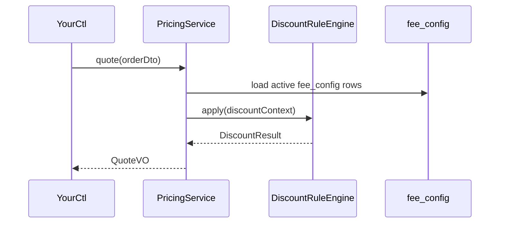

# [Your Domain] / [Example Sub-domain]

> last_verified_commit: <commit-hash>
> source_files: 18 files under `service/yourdomain/pricing/`

This is the template for a SUB-DOMAIN doc -- where the depth lives. Every
section below is required. Fill them with concrete literals (class names, table
names, error codes, config keys, endpoint paths): those literals are what makes
`/business-logic search` return anything useful.

## Responsibility
One sentence: what this sub-domain owns.
Then state what it does NOT cover, naming the sibling doc that does -- that
boundary is what stops two docs from drifting into each other.

## Entry Points
| Trigger | Entry | Handler |
|---------|-------|---------|
| HTTP | `POST /v1/your-domain/quote` | `YourCtl.quote()` -> `PricingService.quote()` |
| Event | `OrderCreatedEvent` | `PricingListener.onOrderCreated()` |
| Job | cron `0 */5 * * * ?` | `PricingRefreshJob.run()` |

## Core Flow


## Call Chain
One line per hop -- symbol, file, and what the hop actually does. Keep the
indentation: it is what shows nesting and branching at a glance, and that is the
whole point of this section. No line numbers.

```
YourCtl.quote()                 -- controller/YourCtl.java      -- validates the request DTO
  -> PricingService.quote()     -- service/PricingService.java  -- orchestrates the quote
    -> FeeConfigMapper.selectActive()  -- mapper/FeeConfigMapper.java -- reads fee_config
    -> DiscountRuleEngine.apply()      -- rule/DiscountRuleEngine.java -- applies tiered discounts
      -> TierResolver.resolve()        -- rule/TierResolver.java       -- maps user level -> tier
  -> QuoteAssembler.toVO()      -- assembler/QuoteAssembler.java -- builds the response
```

Then call out the load-bearing hops -- the tree shows WHAT happens, these say
where it hurts:

- `PricingService.quote()` -- reads `fee_config` OUTSIDE the transaction, so a
  concurrent rule edit can land mid-quote; guarded by `configVersion`.
- `DiscountRuleEngine.apply()` -- silently falls back to `TIER_DEFAULT` when
  `TierResolver` was not seeded. **This is the trap**: no error, wrong price.
- `QuoteAssembler.toVO()` -- rounds to 2 decimals; the rate is basis points, so
  rounding happens AFTER the multiplication, never before.

## Business Rules
- Quotes are valid for `pricing.quote.ttl-seconds` (default 30); expired quotes
  are rejected with `QUOTE_EXPIRED`.
- Discount tiers come from `fee_config.tier_level`; a user with no tier falls
  back to `TIER_DEFAULT`.
- Error codes: `QUOTE_EXPIRED`, `FEE_CONFIG_MISSING`, `DISCOUNT_RULE_CONFLICT`.

## Key Symbols
The searchable index: one row per significant class/method in this sub-domain.
Every file in the sub-domain's scope should be reachable from this table or from
the call chain above.

| Symbol | File | Role |
|--------|------|------|
| `PricingService.quote()` | `service/PricingService.java` | entry for all quote requests |
| `DiscountRuleEngine.apply()` | `rule/DiscountRuleEngine.java` | evaluates tier + promo rules |
| `TierResolver.resolve()` | `rule/TierResolver.java` | user level -> discount tier |
| `FeeConfigMapper.selectActive()` | `mapper/FeeConfigMapper.java` | reads active `fee_config` rows |

## Database
| Table | Key fields | Purpose |
|-------|-----------|---------|
| fee_config | id, tier_level, rate, active | tiered fee rates |
| quote_log | id, order_id, quote_id, expire_at | issued quotes, for audit |

Cache keys: `pricing:quote:{orderId}` (TTL 30s), `pricing:tier:{userId}` (TTL 5m).

## Pitfalls
- Concurrency: `fee_config` is hot-reloaded; a rule edit mid-quote can yield two
  different rates within one order. Guarded by `configVersion` on the quote.
- Boundary: `rate` is applied as basis points; a value above `10000` silently
  inverts the sign downstream.
- Common mistake: calling `DiscountRuleEngine.apply()` without seeding
  `TierResolver` first, which silently applies `TIER_DEFAULT`.

## Related
- Sibling sub-domain that consumes the quote at settlement (link it once
  `settlement.md` exists -- not before).
- The calling domain's `overview.md`.
