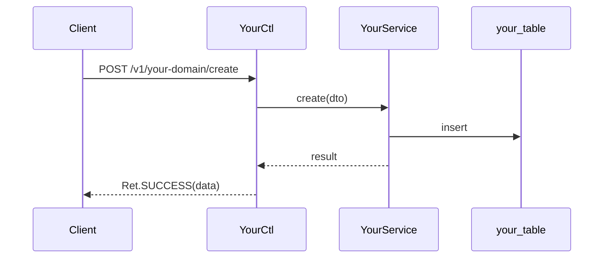

# [Your Domain] Overview

> last_verified_commit: <commit-hash>
> source_packages:
> - com.example.yourproject.service.yourdomain

This is a filled example of the DOMAIN MAP. It is deliberately shallow: the map
routes, the sub-domain docs carry the knowledge. Replace every placeholder with
your own content, then delete this note.

> A domain of 25 source files or fewer may keep everything here instead, adding
> the `Business Rules` / `Code Location` / `Database` / `Pitfalls` sections from
> `example-subdomain.md` inline. Above that, split -- one file cannot stay
> searchable.

## Quick Index
- Core entry: `YourCtl` (`/v1/your-domain/...`)
- Core service: `YourService`
- Core table: `your_table`
- Core events: `YourEvent` (AMQP/NATS)
- Most-changed spots: `YourService.doStuff()`
- High-risk spots: concurrent writes to `your_table`

## Business Overview
One sentence describing what this domain does, followed by 2-3 lines of context.

## Sub-domains
One row per sub-domain doc in this directory. This table is what a reader scans
first, so `Owns` must say what lives there in concrete terms.

| Doc | Scope | Owns |
|-----|-------|------|
| [example-subdomain](example-subdomain.md) | `service/yourdomain/pricing/` (18 files) | fee calculation, discount rules, `fee_config` |

Add one row per sub-doc as you write it — `settlement.md`, `notify-system.md`,
`database-schema.md`. Add the row when the doc exists, never before: a link to
an unwritten doc is the `(planned)` anti-pattern the depth rules reject.

## API Entry Points
The full list for the domain; each row points at the sub-doc that details it.

| Method | Path | Controller | Service | Detailed in |
|--------|------|------------|---------|-------------|
| POST | /v1/your-domain/create | YourCtl | YourService.create | [example-subdomain](example-subdomain.md) |

## Core Flow
The domain's main path only -- each step links into the sub-doc that owns it.

## Cross-domain Interfaces
- **Exposes**: `YourService.create()` -- called by the `order` domain.
- **Consumes**: `AccountService.freeze()` from the `account` domain.
- **Events out**: `YourEvent` -- consumed by the `notification` domain.

## Related Docs
- [Another Domain](../another-domain/overview.md) -- how it relates.
- Cross-cutting rules: see your project's `.claude/context/` files.
