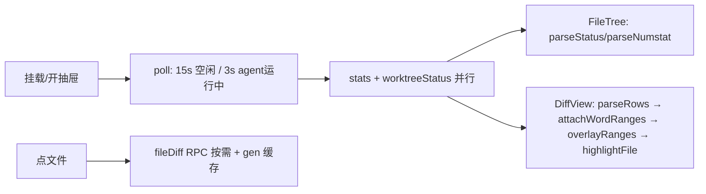

# stats-drawer Overview

> last_verified_commit: bdc8ad5
> source_packages:
> - src/client/**（面板全部）+ src/style-store.ts + src/commit-cache.ts + src/git-log.ts

## Quick Index
- Core entry: `src/client/index.ts` 的 `apply(ctx)` → `ctx.slots.inject('conversation.session.header.actions', ...)`
- Core service: `GitWorkbenchPanel.tsx`（约 3400 行：Chip + Drawer + 三页签）
- Core state: 宿主 `~/.dsh/gitworkbench-style.json`（背景/CSS）、localStorage（宽度/主题）
- Most-changed spots: `GitWorkbenchPanel.tsx`、`GitWorkbenchPanel.module.css`（14 套调色板）
- High-risk spots: 轮询不得重置 UI 状态（展开/选中）；CSS 栈序与同优先级修饰类（见 Potential Pitfalls）；diff 容量上限截断

## Business Overview
会话头的环境卡：分支 + ahead/behind + 增删计数（干净树也显示，仅 `stats.error` 时隐藏）。点开抽屉 = 文件树 + diff 两栏（变更页）或 提交列表 + 树 + diff 三栏（历史页），外加任意两分支对比页。

抽屉 chrome 收敛为三行：header（**分支胶囊就是 worktree 选择器本体**、齿轮下挂设置浮层、四个图标按钮 最大化/刷新/设置/关闭）、tabs、syncBar——分支名与 ↑↓ 计数全抽屉各只出现一次（曾各两处）。

## API Entry Points（客户端 → 宿主 RPC）
| RPC | 用途 |
|---|---|
| `gitWorkbench/stats` | 工作区 vs HEAD 全景（`git diff HEAD` + untracked 合成段） |
| `gitWorkbench/fileDiff` | 单文件按需 diff（tracked: `git diff HEAD --`；untracked: 宿主 readFile 合成） |
| `gitWorkbench/commits` / `commitStats` / `compareRefs` | 历史翻页（--topo-order）/ 单提交视图 / 两分支对比 |
| `gitWorkbench/styleGet` / `styleSet` | 背景/CSS 两作用域读写 |

## Core Flow

## Business Rules
- 轮询每次返回**新数组引用**：树展开状态提升到会话级组件，gen 只在手动刷新时 bump（README §6.0c）
- diff 双上限：整体 `DIFF_CHAR_CAP` 400KB、untracked 合成段 `UNTRACKED_TOTAL_CHAR_CAP` 160KB；单 untracked >1MB 只计数
- 词级高亮 = 相邻 −/+ 行 token LCS（`attachWordRanges`，>200k 单元格退化整行）；语法色 = Shiki 本地包（`highlight.ts`，语法按需分包）
- 主题 7 族 × 亮暗（`themes.ts` `THEME_FAMILIES` ↔ CSS `[data-gs-theme]` 选择器，`tests/theme-palettes.test.ts` 互扣）；明暗默认跟随 dsh 宿主 `body` 属性而非 `prefers-color-scheme`
- **每套调色板必须定义完整核心 token 集**：漏一个不报错——它会继承上一主题留在 `.overlay` 上的值，渲染成两主题混色（`theme-palettes.test.ts` 守完整性）。GitHub 两套逐值对住 Primer `diffBlob`（暗色 alpha 已在 `#0d1117` 上拍平，见 `drawer-chrome.test.ts` 的 `GITHUB_DIFF`）；IDEA 套读自 New UI 界面而非公开 token 文件，精度不同（源码注释写明）
- **同步条把状态穿在按钮上**：`behind>0` → Pull 染 `--gs-warn` 且计数进按钮；`ahead>0` → Push 染 `--gs-add`；无 upstream → 首推变实心 Publish（accent）；Fetch **永远中性**（只读无新闻可报，`.btnFetch` 变体被测试禁止存在——留一个安静，另两个才读得出是信号）。pull 策略选择器焊在 Pull 上（segmented）：它是 Pull 的参数，不是第三个动作。变体类 `btnAhead/btnBehind/btnPrimary/headerPicker` 只染色绝不声明几何（height/padding/font-size/border-radius/line-height）
- **快速操作不眨眼**：勾选即 git 调用，`running` 立即置禁用是对的（防第二次调用），但 ~150ms 的 `opacity:.45` 是眨眼不是反馈——凡被 `running` 新禁用的控件必须带 `data-quiet`，由样式表 `[data-quiet]:disabled { opacity: 1 }` 压掉变暗；因自身原因不可用的（如无 upstream 的 Pull）**不** quiet（`quietlyDisabled(running, sustained, noUpstream)`），否则不可用看起来可用、随操作变老再暗又是新闪烁
- **刷新不得清空它即将替换的数字**：`showsPending(loading, fileCount)`（worktree-view.ts）——loading 且文件数为 0 才显示占位；每个 tick 的普通刷新跑在屏上仍正确的数据上，按原始 loading 标志画占位会把 header 数字换成 `—` 再换回（实测 400ms，恰好读作闪烁）。该规则全文件只住 worktree-view 一处（TSX 里禁止再写 `loading && files.length === 0`）
- **关着的芯片在 turn 结束时刷新 stats**：`turnSettled(prev, next)`（worktree-view.ts，仅 `prev === true && next !== true`）——`running` 由 sessions store 实时镜像，turn 边界即 agent 副作用落定时刻；该沿触发一次 `fetchStats` 受卫写入（`statsPathRef` 守卫、不 bump gen、不翻 statsLoading——后台刷新不得重置树展开/闪占位）。↑↓ 随 stats 载荷一起回来，所以 agent 提交完芯片的 ahead 也对上。空闲的关芯片仍是挂载快照（编辑器等外部改动不跟，开抽屉即新）；turn 进行中不刷（若嫌滞后，升级路径是订阅 live `updatedAt` 做 trailing debounce）。与 binding 探针同住 worktree-view：一个管「在哪个 worktree」，一个管「数字是多少」。探针：`scripts/verify_turn_refresh.py`（安静会话 + scratch worktree + 一次真实 turn，断言关芯片 3s 内不刷、turn 结束后自绘 +3 −0）
- **长名省略只让出头部**：`.elide/.elideHead/.elideTail` 两段式——叶段区分兄弟、必须存活；`flex` 收缩权重 head > tail（无斜杠的超长名仍能收缩而非撑破行）；禁止 `direction: rtl`（一个声明截左边，但会重排 Windows 路径的反斜杠）；分支名截断交给 CSS，`branch.slice(`/手补 `…` 被测试禁止（原 `shortBranch` 在 JS 里砍 21 字符：无视可用宽度，且砍掉的正是说清是哪个分支的尾部）
- 用户 CSS 抓手是 `data-gs-part` 稳定属性（CSS Modules 哈希类名外部选不中）

## Code Location
`GitWorkbenchPanel`（面板）、`parseRows/gutterSides`（diff-model）、`samePath/viewedPath/showsPending/badgeRepeatsBranch/splitPath/branchOfWorktree`（worktree-view，纯函数、不 import React/CSS 才可测）、`resolveTheme/effectiveBackground/effectiveCss`（themes）、`sanitizeEntry/IMAGE_PATTERN`（style-store，image 只收 base64 data: URL）、`CommitPayloadCache`（commit-hash 内容寻址 LRU）、`parseLog`（git-log，`--pretty=format:` 解析）
结构不变量守卫：`tests/drawer-chrome.test.ts`（按钮词汇表/修饰类序/省略规则/quiet 标记/showsPending 单点）、`tests/diff-regression.test.ts`（栈序/设置浮层/图标按钮/diff 行高）

## Database（状态文件）
`~/.dsh/gitworkbench-style.json`：`{v:1, global, projects{repoRoot}}`，项目优先；背景图整条取项目、CSS 两作用域叠加（global 前 project 后）

## Potential Pitfalls
- **CSS 栈序是序关系不是数字表**：`.drawer > .header > .tabs > .compareBar > .syncBar` 的 z-index 必须沿 DOM 序**严格递减**，最低一条 bar 仍 > `.body`（z-index 1）。popover 只向下弹，上方 bar 的菜单必须压过下方一切 bar。曾三次踩坑：bar 与 `.body` 同层菜单被吃；全部 bar 同为 20 时上层菜单被下层吸掉；header 与 tabs 打平 23 时后者（源码序靠后的兄弟）吞掉 worktree 菜单——**同值即输**，测试因此断言严格递减而非硬编码数字
- **同优先级修饰类必须压过基类**：`` `${css.base} ${css.mod}` `` 与基类同 specificity，谁赢由样式表源码序决定——修饰类写在共享词汇表（文件后部）之前就静默失效（规则在、值对、渲染像没写）。修法：限定成 `.refButton.headerPicker` / `.refPop.settingsPop`（更高优先级、位置无关）。`drawer-chrome.test.ts` 从 TSX 读出全部类组合自动覆盖后来者；注意只比"裸选择器"规则（`.btn:disabled`、`.pullGroup > .btn` 本就更高优先级、合法地赢）
- **对源码文本做断言的三条纪律**（本仓库已两次被注释骗过）：先剥注释（CSS/TSX 注释会被吞进"选择器"或被数成出现次数）；miss 读作 pass，必须 `rules.length > 0` 兜底（曾因正则限定后循环跑零次而"全绿"）；新断言做变异验证（改掉被守代码确认变红）
- Playwright 对此 UI：禁 `networkidle`（长连 WebSocket）；哈希类名用 `[class*=local]`；无头默认英文词典（zh/en 双匹配）
- 客户端 `@deepseek-ai/*` 必须 `import type`（bundle 纯度门）
- `commitStats` 才缓存（hash 寻址不可变）；`stats` 绝不缓存（工作区随时变）

## Related Docs
[write-ops](../write-ops/overview.md)（树上的勾选与提交框）、[plugin-loading](../plugin-loading/overview.md)（插槽注册与 RPC 通道）、[worktree-emulation](../worktree-emulation/overview.md)（header 选择器的显示推导与 pin 规则）
