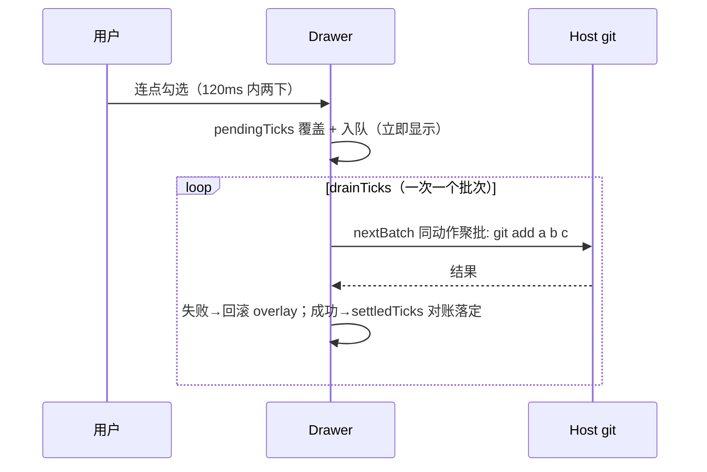

# write-ops Overview

> last_verified_commit: ad6bbeb
> source_packages:
> - src/git-ops.ts、src/client/stage-tree.ts、src/client/op-feedback.ts（+ src/index.ts 的 write ops 区）

## Quick Index
- Core entry: RPC `gitWorkbench/stage/unstage/commit/fetch/pull/push/switchBranch/syncStatus`（src/index.ts 尾段）
- Core service: `GitWorkbenchService.writeOp()`（统一跑批 + 失败归类）
- Most-changed spots: `stage-tree.ts`（勾选模型）、`git-ops.ts`（argv 构造）
- High-risk spots: 点击不丢（队列）、绝不构造破坏性命令

## Business Overview
不离开抽屉完成一次提交与推送：树勾选即 `git add`/`git restore --staged`，提交框写消息，同步条 fetch/pull/push。

## Core Flow（乐观勾选 + 队列，no click dropped）

## Business Rules
- **argv 硬化**（`git-ops.ts`）：数组构造无 shell；路径一律 `--` 之后且 `isSafePathArg` 拒绝前导 `-`；空路径表拒绝（防整树 add）；`commitArgv` 绝不 `-a`（抽屉有暂存区，分区不能是摆设）；全库无 `--force`/`reset --hard`/`clean` 任何拼写
- **push 绝不 force，首次 push 的 remote 不写死 `origin`**：有 upstream 时裸 `push`（尊重用户 push 配置）；无 upstream 时 `pushRemote(remotes, configured)` 决定去处——配置的 push remote（`branch.<name>.pushRemote` 优先于 `remote.pushDefault`，RPC 读两者取先设的）且必须真在 remote 列表里（陈旧值拒绝并点名配置键）、其次 `origin`、否则唯一的那个 remote、多个且无 origin 才拒绝并列出名字与配置键（`origin` 是 `git clone` 的习惯不是 git 的要求，同步条只看 `git remote` 有无输出就显示按钮，remote 叫 `upstream` 的仓库曾必失败；README §6.28）；`pushArgv(branch, remote | null)`，remote 名同样过 `isSafePathArg`；RPC 只在无 upstream 路径上并行问 `git remote` 与两个配置键；被拒归类 `diverged`（答案是先 pull）。守卫 `tests/push-remote.git.test.ts`（真 git：唯一 remote 叫 `upstream`，旧 argv 失败、新 argv 落地并跟踪）
- **pull 模式永远显式**（`--ff-only`/`--rebase`/`--no-rebase`）：按钮写什么跑什么，不读用户 pull.rebase 配置
- **syncStatus 读 `git status` 而非 `rev-list --count`**：'没配 upstream' 和 '与 upstream 齐平' 计数都是 0，只有前者决定 push 参数
- **防挂死**：`NON_INTERACTIVE_ENV`（GIT_TERMINAL_PROMPT=0 / GCM_INTERACTIVE=never / askpass 置空）——stdin:'ignore' 把交互提示变成没人能答的等待，挂在宿主进程里；网络操作 grace 120s
- **失败说人话**：`classifyFailure` 把 exit/stderr 归类 auth/no-upstream/diverged/conflict/nothing-to-commit/dirty，原文随行（归类是提示不替代证据）；`capStderr` 截断保首尾（1200 封顶）——git 把归类关键词放 stderr 头部、文件列表放其后，尾截会把关键词推出窗口（分支切换器的实机探针抓到过，六文件即触发）
- **切分支只在主工作树**（`switchBranch`）：宿主 `isMainWorktree`（`--git-dir` ≡ `--git-common-dir`，都要 `--path-format=absolute`——子目录下后者印相对路径）拒绝 linked worktree 的调用，客户端同步隐藏控件——门比的是所看树的**根**（`samePath(mainWorktreePath, stats.repoRoot)`），不是会话路径：workspace 开在仓库子目录 `A/B` 时 `A ≠ A/B`，比路径会把宿主接受的调用藏掉（README §6.26；守卫 `tests/switcher-gate.test.ts` 剥注释源扫描 + 变异验证）；`switchArgv` 本地选中带 `--no-guess`（本地行只指本地分支）、远端选中 `-c --track`（创建并跟踪），永不 `--force`/`-C`/`--discard-changes`——带不动的改动 git 拒绝、归类 dirty，改动无损
- **锁是 ref 不是 state**：`busyRef` 防 drain 循环内闭包看不到彼此（handoff Task 1 踩过）；源切换 epoch 退役旧 drain

## Code Location
`stageArgv/unstageArgv/commitArgv/fetchArgv/pullArgv/pushArgv/pushRemote/switchArgv/remoteOnlyBranches/capStderr`（git-ops）、`tickedFlags/withPendingTicks/settledTicks/nextBatch`（stage-tree，各有单测）、`stageStateOf`（冲突 XY 一律算 unstaged——带冲突标记的文件不该被提交）、`parseTracking`（`##` 头解析，分支含点时按最后一个 `...` 切）

## Database
无（写操作直达 git 索引/远端）

## Potential Pitfalls
- tick 是真 git 调用：绝不对着有人正在看的 worktree 驱动勾选（用 fixture-01）
- RPC 失败被客户端折叠成 '' 的误导文案族（fetchFileDiff→'无差异'）是已知 MINOR，未修
- `.finally(setLoading(false))` 会被 abort 请求清掉新请求的 loading（MINOR，未修）

## Related Docs
[stats-drawer](../stats-drawer/overview.md)（树与提交框的渲染侧）、[worktree-emulation](../worktree-emulation/overview.md)（写操作的目标路径可能来自绑定）
